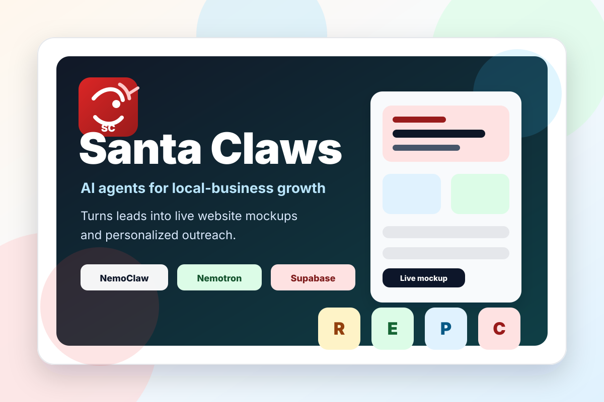

<!-- Back to top link -->
<a id="readme-top"></a>

<!-- PROJECT SHIELDS -->
[![Contributors][contributors-shield]][contributors-url]
[![Stargazers][stars-shield]][stars-url]
[![Issues][issues-shield]][issues-url]

<br />
<div align="center">

  <a href="https://github.com/PartyD1/santaclaws">
    
  </a>

  <p align="center">
    <br />
    AI agents that turn local business leads into live website mockups and personalized outreach.
    <br />
    <br />
    <a href="#running-locally">Run It Locally</a>
    &middot;
    <a href="https://github.com/PartyD1/santaclaws/issues/new?labels=bug">Report Bug</a>
    &middot;
    <a href="https://github.com/PartyD1/santaclaws/issues/new?labels=enhancement">Request Feature</a>
  </p>
</div>

---

<!-- TABLE OF CONTENTS -->
<details>
  <summary>Table of Contents</summary>
  <ol>
    <li><a href="#about-the-project">About the Project</a></li>
    <li><a href="#features">Features</a></li>
    <li><a href="#agent-team">Agent Team</a></li>
    <li><a href="#built-with">Built With</a></li>
    <li><a href="#how-it-works">How It Works</a></li>
    <li><a href="#discord-controls">Discord Controls</a></li>
    <li><a href="#api-reference">API Reference</a></li>
    <li><a href="#database-memory">Database Memory</a></li>
    <li><a href="#project-structure">Project Structure</a></li>
    <li><a href="#running-locally">Running Locally</a></li>
    <li><a href="#running-in-a-nemoclaw-sandbox">Running in a NemoClaw Sandbox</a></li>
    <li><a href="#running-on-brev">Running on Brev</a></li>
    <li><a href="#troubleshooting">Troubleshooting</a></li>
    <li><a href="#what-we-learned">What We Learned</a></li>
    <li><a href="#license">License</a></li>
    <li><a href="#contact">Contact</a></li>
    <li><a href="#acknowledgments">Acknowledgments</a></li>
  </ol>
</details>

---

<!-- ABOUT THE PROJECT -->
## About the Project

Santa Claws is a hackathon project that turns a small team of AI agents into an autonomous sales workshop for local businesses.

The system finds local business leads, builds polished website mockups, deploys those mockups to Vercel, drafts personalized outreach, routes approvals through Discord, and shows the full workflow in a live dashboard.

The core idea is simple:

> NemoClaw gives us secure always-on claws. Supabase gives them shared memory. Nemotron gives them reasoning.

The agents never call each other directly. Supabase is the queue, the shared memory layer, and the audit log. Every important action writes a human-readable row to the `actions` table so the dashboard can show what the system is doing in real time.

Each claw is a Python heartbeat. It runs on a fixed interval, claims one row of work, calls its tools, writes the result back, logs the action, and sleeps until the next tick.

<p align="right">(<a href="#readme-top">back to top</a>)</p>

---

<!-- FEATURES -->
## Features

- **Four-agent pipeline:** Scout, Designer, Pitcher, and Closer each own one stage of the workflow
- **Persistent memory:** Supabase stores leads, generated sites, outreach, approvals, logs, replies, meetings, and per-agent memory
- **Lead discovery:** Scout uses the Apify Google Places actor to find local businesses, score their websites, and qualify email-ready rows
- **Website generation:** Designer builds industry-specific mockup variants, critiques them, picks a winner, and deploys it to Vercel
- **Personalized outreach:** Pitcher drafts several email angles and pastes the exact Vercel mockup URL from the database into the winner
- **Human approval loop:** Discord commands approve, skip, edit, or run any claw on demand
- **Autonomous mode:** `AUTONOMOUS_MODE=true` auto-approves and sends for hands-off demo runs
- **Reply handling:** Closer classifies inbound replies, drafts follow-ups, and proposes meeting times
- **Live dashboard:** Next.js dashboard shows metrics, leads, per-claw pages, generated sites, activity logs, and memory in real time
- **Secure runtime:** claws run inside a NemoClaw sandbox with explicit network egress policies and a managed Nemotron inference route
- **Demo fallbacks:** seed data and fallback behavior keep the project presentable when a live API fails

<p align="right">(<a href="#readme-top">back to top</a>)</p>

---

<!-- AGENT TEAM -->
## Agent Team

| Claw | Role | Cadence | What it does |
|---|---|---|---|
| Rudolph Scout | Lead Finder | 60s | Finds local businesses, scores websites, extracts pain points, and qualifies email-ready leads |
| Workshop Elves | Mockup Forge | 60s | Builds mockup variants, critiques them, picks the winner, and deploys it to Vercel |
| Snowball Pitcher | Outreach Courier | 60s | Writes personalized email angles and queues the strongest one for approval or sending |
| Cookie Closer | Reply Handler | 30s | Classifies inbound replies, drafts follow-ups, and moves warm leads toward meetings |
| Discord Bridge | Approval Worker | 30s | Listens for APPROVE, SKIP, EDIT, and RUN commands and answers pipeline questions |

Every claw lives in `agents/<claw>/` with the same NemoClaw and OpenClaw-compatible context files:

| File | Purpose |
|---|---|
| `claw.py` | The heartbeat entrypoint |
| `SOUL.md` | Personality and voice |
| `AGENTS.md` | Operating rules for the claw |
| `HEARTBEAT.md` | What one tick should do |
| `TOOLS.md` | Tools the claw is allowed to call |
| `MEMORY.md` | Durable patterns the claw has learned |
| `tools/` | One Python module per tool |

The registry for all five agents, their intervals, and the inference route is in `agents/nemoclaw.json`.

<p align="right">(<a href="#readme-top">back to top</a>)</p>

---

<!-- TECH STACK -->
## Built With

[![Next.js][Next.js-badge]][Next-url]
[![React][React-badge]][React-url]
[![TypeScript][TypeScript-badge]][TypeScript-url]
[![TailwindCSS][Tailwind-badge]][Tailwind-url]
[![Python][Python-badge]][Python-url]
[![Supabase][Supabase-badge]][Supabase-url]
[![PostgreSQL][PostgreSQL-badge]][PostgreSQL-url]
[![NVIDIA][NVIDIA-badge]][NVIDIA-url]
[![Docker][Docker-badge]][Docker-url]
[![Vercel][Vercel-badge]][Vercel-url]
[![Discord][Discord-badge]][Discord-url]

Additional services:

- **NemoClaw** sandbox runtime with OpenShell-compatible context files
- **Nemotron 3 Nano Omni 30B** reasoning through the managed `inference.local` route inside the sandbox
- **Apify** Google Places actor for lead discovery
- **Resend** or plain SMTP for outbound email
- **Google Calendar** for meeting booking, **Vapi** for voice calls (stretch)
- **NVIDIA Brev** Ubuntu instance for the live demo runtime

<p align="right">(<a href="#readme-top">back to top</a>)</p>

---

<!-- HOW IT WORKS -->
## How It Works

```text
Lead discovery -> Website mockup -> Personalized pitch -> Approval or send -> Reply handling -> Meeting workflow
```

1. Scout finds local businesses and writes rows to `leads`
2. Scout scores each website, extracts pain points, and qualifies email-ready leads for mockups
3. Designer picks a qualified lead, builds mockup variants, critiques them, chooses the winner, and deploys it to Vercel
4. Designer writes the Vercel URL to `generated_sites.vercel_url`
5. Pitcher drafts several outreach angles and pastes the exact Vercel URL into the chosen email
6. Discord approval or autonomous mode marks the outreach as approved
7. Pitcher sends through Resend or SMTP
8. Replies land in `inbound` through the inbound email webhook
9. Closer classifies replies, drafts follow-ups, and handles the meeting workflow
10. Every step logs a row to `actions`, and the dashboard streams those rows live

The workflow is intentionally database-driven. Supabase is the queue:

```text
SELECT work -> claim row -> run tool -> write result -> log action -> next heartbeat
```

<p align="right">(<a href="#readme-top">back to top</a>)</p>

---

<!-- DISCORD CONTROLS -->
## Discord Controls

The Discord worker handles approvals, runs claws on command, and answers free-form questions about the pipeline using Nemotron.

```text
HELP
RUN SCOUT
RUN DESIGNER
RUN PITCHER
RUN CLOSER
RUN ALL
APPROVE <outreach_id>
SKIP <outreach_id>
EDIT <outreach_id> <new body>
```

Start the worker from the repo root:

```bash
python -m workers.discord_bridge
```

The worker loads the repo-root `.env` file, so run it from the same checked-out repo the agents use. Each `RUN` command executes one heartbeat in a subprocess with a 240 second timeout and replies with the tail of the output.

<p align="right">(<a href="#readme-top">back to top</a>)</p>

---

<!-- API REFERENCE -->
## API Reference

The dashboard exposes three Next.js route handlers. They are webhook targets, not a public API.

| Method | Endpoint | Description |
|---|---|---|
| `POST` | `/api/discord-reply` | Parses `APPROVE`, `SKIP`, or `EDIT` from a Discord message payload and updates `outreach` |
| `POST` | `/api/inbound-email` | Accepts an inbound email webhook and writes the reply to `inbound` for Closer |
| `POST` | `/api/trigger-demo` | Inserts a demo reply for the most recent `DEMO - ` lead so Closer has work during a demo |

All three read Supabase credentials from the dashboard environment and return a JSON body with an `ok` flag and a reason when they skip.

<p align="right">(<a href="#readme-top">back to top</a>)</p>

---

<!-- DATABASE MEMORY -->
## Database Memory

| Table | Purpose |
|---|---|
| `leads` | Businesses found by Scout and moved through the pipeline |
| `generated_sites` | Designer mockups, chosen winner metadata, and Vercel URLs |
| `outreach` | Pitcher drafts, approvals, send status, and email bodies |
| `actions` | Human-readable claw activity logs for the dashboard |
| `approvals` | Discord or fallback approval decisions |
| `inbound` | Inbound email replies for Closer |
| `meetings` | Booked or demo-fallback meetings |
| `agent_memory` | Durable per-agent memory patterns |

Apply the schema by running this file in the Supabase SQL editor:

```text
agents/scripts/setup_supabase.sql
```

Seed demo data and reset the database with the helper scripts:

```bash
python -m agents.scripts.seed_demo_data
python -m agents.scripts.nuke_db
```

<p align="right">(<a href="#readme-top">back to top</a>)</p>

---

<!-- PROJECT STRUCTURE -->
## Project Structure

```text
santaclaws/
├── agents/
│   ├── scout/                    # Lead discovery claw
│   ├── designer/                 # Mockup generation claw
│   ├── pitcher/                  # Outreach drafting and sending claw
│   ├── closer/                   # Inbound reply claw
│   ├── discord_bridge/           # Discord approval worker claw
│   ├── integrations/             # Apify, Vercel, Resend, SMTP, Google Calendar, Vapi, Supabase Storage clients
│   ├── prompts/                  # Nemotron prompt templates for each tool
│   ├── scripts/                  # Preflight, seed data, setup SQL, start/stop scripts, NemoClaw runner
│   ├── shared/                   # Supabase client, Nemotron client, logger, memory, runtime helpers
│   ├── nemoclaw.json             # Agent registry, intervals, and inference route
│   └── requirements.txt          # Python dependencies
│
├── dashboard/
│   ├── app/                      # Next.js App Router pages and API route handlers
│   ├── components/               # Claw cards, leads table, activity feed, mockup preview
│   ├── lib/                      # Supabase clients, realtime, types, branding
│   └── public/                   # Static dashboard assets and hackathon thumbnail
│
├── workers/                      # Discord bridge, inbound email worker, Vapi webhook
├── nemoclaw/                     # Sandbox onboarding scripts, model routing, network policy notes
├── scripts/                      # One-shot NemoClaw setup for a fresh Brev instance
├── integrations/                 # Top-level integration clients
├── docs/                         # Execution spec and progress log
├── obsidian/                     # Obsidian vault config for agent memory notes
├── .env.example                  # Root environment template for agents and workers
├── docker-compose.yml            # Compose project name placeholder
└── README.md
```

Useful docs:

- [Execution spec](docs/Mainstreet_NemoClaw_Codex_Execution_Spec.md)
- [Progress log](docs/PROGRESS.md)
- [NemoClaw setup notes](nemoclaw/README.md)
- [Model routing](nemoclaw/model-routing.md)
- [Network policy](nemoclaw/network-policy.md)

<p align="right">(<a href="#readme-top">back to top</a>)</p>

---

<!-- RUNNING LOCALLY -->
## Running Locally

**Prerequisites:** Python 3.11+, Node.js 18+, npm, a Supabase project, NVIDIA API key (or a NemoClaw sandbox), Apify token, Vercel token, and a Discord bot token for approvals.

Clone the repo:

```bash
git clone https://github.com/PartyD1/santaclaws.git
cd santaclaws
```

Create the Python environment:

```bash
python3 -m venv .venv
source .venv/bin/activate
pip install -r agents/requirements.txt
```

Create the root env file:

```bash
cp .env.example .env
```

Core `.env` values for local development outside the sandbox:

```bash
NVIDIA_API_KEY=
NEMOTRON_BASE_URL=https://integrate.api.nvidia.com/v1
NEMOTRON_MODEL=nvidia/nemotron-3-nano-omni-30b-a3b-reasoning
SUPABASE_URL=
SUPABASE_ANON_KEY=
SUPABASE_SERVICE_KEY=
APIFY_TOKEN=
VERCEL_TOKEN=
VERCEL_PROJECT_NAME=mainstreet-mockups
RESEND_API_KEY=
OUTREACH_FROM_ADDRESS=
DISCORD_BOT_TOKEN=
DISCORD_APPROVAL_CHANNEL_ID=
AUTONOMOUS_MODE=false
```

Set `EMAIL_PROVIDER=smtp` and fill the `SMTP_*` values to send from a personal inbox instead of Resend.

Apply the database schema by running `agents/scripts/setup_supabase.sql` in the Supabase SQL editor, then confirm connectivity:

```bash
python -m agents.scripts.preflight_check
```

Install dashboard dependencies:

```bash
cd dashboard
npm install
cp .env.local.example .env.local
```

Fill `dashboard/.env.local`:

```bash
NEXT_PUBLIC_SUPABASE_URL=
NEXT_PUBLIC_SUPABASE_ANON_KEY=
SUPABASE_SERVICE_KEY=
```

Run the dashboard:

```bash
npm run dev
```

Open [http://localhost:3002](http://localhost:3002).

Run one heartbeat at a time from the repo root:

```bash
source .venv/bin/activate
python -m agents.scripts.openclaw_run scout --once
python -m agents.scripts.openclaw_run designer --once
python -m agents.scripts.openclaw_run pitcher --once
python -m agents.scripts.openclaw_run closer --once
```

Run every claw once, or keep them all looping:

```bash
python -m agents.scripts.openclaw_run all --once
python -m agents.scripts.openclaw_run all
```

Start and stop the whole team in the background:

```bash
bash agents/scripts/start_all_claws.sh
bash agents/scripts/stop_all_claws.sh
```

Validation:

```bash
python -m compileall agents workers
python -m agents.scripts.preflight_check --skip-live
cd dashboard && npm run typecheck
```

<p align="right">(<a href="#readme-top">back to top</a>)</p>

---

<!-- NEMOCLAW SANDBOX -->
## Running in a NemoClaw Sandbox

This is the intended demo runtime. The claws run inside a NemoClaw sandbox named `mainstreet`, Nemotron is reached through the managed `inference.local` route with no API key, and outbound network access is limited to explicit policies.

Create the sandbox on the host and add network policies:

```bash
bash nemoclaw/install_and_onboard.sh
```

If the sandbox does not exist yet, the script prints the interactive onboarding command to run first:

```bash
nemoclaw onboard --name mainstreet --yes-i-accept-third-party-software
```

Open a shell inside the sandbox:

```bash
nemoclaw mainstreet connect
```

Inside the sandbox, install dependencies, run preflight, and start all five agents:

```bash
bash /workspace/mainstreet/nemoclaw/start_inside_sandbox.sh
```

Monitor from the host:

```bash
nemoclaw mainstreet status
nemoclaw mainstreet logs --follow
nemoclaw mainstreet doctor
```

Add egress policies for the services you use. The onboarding script adds `discord` automatically; the full domain list is in `nemoclaw/network-policy.md`.

```bash
nemoclaw mainstreet policy-add <preset-name>
```

<p align="right">(<a href="#readme-top">back to top</a>)</p>

---

<!-- RUNNING ON BREV -->
## Running on Brev

The live demo runs on an NVIDIA Brev Ubuntu instance with Docker. A fresh instance can be bootstrapped with one script.

SSH into the instance, clone the repo, and run the setup script:

```bash
brev shell santaclaws
git clone https://github.com/PartyD1/santaclaws.git
cd santaclaws
export NVIDIA_API_KEY="nvapi-..."
export NEMOCLAW_SANDBOX_NAME=mainstreet
./scripts/brev-nemoclaw-setup.sh
```

The script checks Docker, installs the NemoClaw CLI, binds the dashboard to `0.0.0.0` so Brev port forwarding works, and runs non-interactive onboarding. It reads these optional variables:

| Variable | Default | Purpose |
|---|---|---|
| `NEMOCLAW_SANDBOX_NAME` | `santaclaws` | Sandbox name. Set to `mainstreet` to match `agents/nemoclaw.json` and the sandbox scripts |
| `NEMOCLAW_PROVIDER` | `nvidia` | Inference provider. Also `openai`, `anthropic`, `ollama`, `routed` |
| `NEMOCLAW_POLICY_TIER` | `balanced` | Network policy tier |
| `NEMOCLAW_SANDBOX_READY_TIMEOUT` | `600` | Seconds to wait for the first image pull |
| `SKIP_INSTALL` | `0` | Set to `1` to skip the installer when `nemoclaw` is already on PATH |
| `FORCE_ONBOARD` | `0` | Set to `1` to run `nemoclaw onboard` again after install |

Once the sandbox is up, follow the [NemoClaw sandbox steps](#running-in-a-nemoclaw-sandbox) to connect and start the agents.

To run the dashboard directly on the instance instead:

```bash
cd ~/santaclaws/dashboard
npm install && npm run dev
```

Then run the Discord worker from a second shell:

```bash
cd ~/santaclaws
source .venv/bin/activate
python -m workers.discord_bridge
```

<p align="right">(<a href="#readme-top">back to top</a>)</p>

---

<!-- TROUBLESHOOTING -->
## Troubleshooting

**Brev setup says Docker is not reachable**

Start Docker on the instance and confirm your user can run it:

```bash
docker info
```

**`nemoclaw` not found after install**

The installer puts the CLI under nvm. Open a new shell or reload nvm, then re-run onboarding:

```bash
source ~/.nvm/nvm.sh
FORCE_ONBOARD=1 ./scripts/brev-nemoclaw-setup.sh
```

**Sandbox scripts cannot find `mainstreet`**

The Brev script defaults the sandbox name to `santaclaws`, but `agents/nemoclaw.json` and the `nemoclaw/` scripts expect `mainstreet`. Re-run with `NEMOCLAW_SANDBOX_NAME=mainstreet`, or check what exists:

```bash
nemoclaw list
```

**Discord worker says it is not running**

Make sure these are in the root `.env` on the machine running the bot, then restart the worker:

```bash
DISCORD_BOT_TOKEN=
DISCORD_APPROVAL_CHANNEL_ID=
```

```bash
python -m workers.discord_bridge
```

**Scout gets Apify HTTP 402**

The Apify error message includes a safe token fingerprint. Confirm the loaded token matches the one in your Apify console without printing the secret:

```bash
python - <<'PY'
from dotenv import load_dotenv
from pathlib import Path
import os
load_dotenv(Path.cwd() / ".env")
token = os.getenv("APIFY_TOKEN", "").strip()
print("APIFY_TOKEN set:", bool(token), "len:", len(token), "last4:", token[-4:])
PY
```

Restart any running Discord bot or Scout process after changing `.env`.

**Designer finds no qualified lead**

Designer only works on email-ready leads that Scout has qualified:

```sql
select qualification_status, worked_by_designer, count(*)
from leads
group by qualification_status, worked_by_designer;
```

**Pitcher drafts but does not send**

Pitcher sends only approved outreach. Approve through Discord, then run Pitcher again:

```text
APPROVE <outreach_id>
```

```bash
python -m agents.scripts.openclaw_run pitcher --once
```

**Nemotron calls fail outside the sandbox**

Inside NemoClaw the base URL is `https://inference.local/v1` with no key. For local development set both:

```bash
NEMOTRON_BASE_URL=https://integrate.api.nvidia.com/v1
NVIDIA_API_KEY=nvapi-...
```

**Dashboard env missing**

Use `dashboard/.env.local`, not the root `.env`, for browser-safe dashboard variables:

```bash
NEXT_PUBLIC_SUPABASE_URL=
NEXT_PUBLIC_SUPABASE_ANON_KEY=
```

<p align="right">(<a href="#readme-top">back to top</a>)</p>

---

<!-- WHAT WE LEARNED -->
## What We Learned

The hardest part of Santa Claws was not making one model call. It was making a multi-agent system reliable enough to demo.

Agentic products need persistent memory, visible logs, clear queues, exact external links, careful environment loading, and simple human controls.

The dashboard became just as important as the agents because it made the autonomous work legible.

<p align="right">(<a href="#readme-top">back to top</a>)</p>

---

<!-- LICENSE -->
## License

Private hackathon project, not licensed for external use.

<p align="right">(<a href="#readme-top">back to top</a>)</p>

---

<!-- CONTACT -->
## Contact

**Parth Doshi**

[![LinkedIn][linkedin-shield]][linkedin-url]
[![GitHub][github-shield]][github-url]

Project: [https://github.com/PartyD1/santaclaws](https://github.com/PartyD1/santaclaws)

<p align="right">(<a href="#readme-top">back to top</a>)</p>

---

<!-- ACKNOWLEDGMENTS -->
## Acknowledgments

Built during a 24-hour hackathon with a focus on demo reliability, persistent agent memory, and making autonomous work visible.

Thanks to the NemoClaw, Nemotron, Supabase, Vercel, Apify, Discord, and Brev ecosystems for the pieces that made the demo possible.

<p align="right">(<a href="#readme-top">back to top</a>)</p>

---

<!-- MARKDOWN LINKS -->
[contributors-shield]: https://img.shields.io/github/contributors/PartyD1/santaclaws.svg?style=for-the-badge
[contributors-url]: https://github.com/PartyD1/santaclaws/graphs/contributors
[stars-shield]: https://img.shields.io/github/stars/PartyD1/santaclaws.svg?style=for-the-badge
[stars-url]: https://github.com/PartyD1/santaclaws/stargazers
[issues-shield]: https://img.shields.io/github/issues/PartyD1/santaclaws.svg?style=for-the-badge
[issues-url]: https://github.com/PartyD1/santaclaws/issues

[linkedin-shield]: https://img.shields.io/badge/-LinkedIn-black.svg?style=for-the-badge&logo=linkedin&colorB=555
[linkedin-url]: https://www.linkedin.com/in/parthmdoshi/
[github-shield]: https://img.shields.io/badge/-GitHub-black.svg?style=for-the-badge&logo=github&colorB=555
[github-url]: https://github.com/PartyD1

[Next.js-badge]: https://img.shields.io/badge/Next.js-000000?style=for-the-badge&logo=nextdotjs&logoColor=white
[Next-url]: https://nextjs.org/
[React-badge]: https://img.shields.io/badge/React-20232A?style=for-the-badge&logo=react&logoColor=61DAFB
[React-url]: https://react.dev/
[TypeScript-badge]: https://img.shields.io/badge/TypeScript-3178C6?style=for-the-badge&logo=typescript&logoColor=white
[TypeScript-url]: https://www.typescriptlang.org/
[Tailwind-badge]: https://img.shields.io/badge/TailwindCSS-06B6D4?style=for-the-badge&logo=tailwindcss&logoColor=white
[Tailwind-url]: https://tailwindcss.com/
[Python-badge]: https://img.shields.io/badge/Python-3776AB?style=for-the-badge&logo=python&logoColor=white
[Python-url]: https://www.python.org/
[Supabase-badge]: https://img.shields.io/badge/Supabase-3FCF8E?style=for-the-badge&logo=supabase&logoColor=white
[Supabase-url]: https://supabase.com/
[PostgreSQL-badge]: https://img.shields.io/badge/PostgreSQL-4169E1?style=for-the-badge&logo=postgresql&logoColor=white
[PostgreSQL-url]: https://www.postgresql.org/
[NVIDIA-badge]: https://img.shields.io/badge/NVIDIA%20Nemotron-76B900?style=for-the-badge&logo=nvidia&logoColor=white
[NVIDIA-url]: https://build.nvidia.com/
[Docker-badge]: https://img.shields.io/badge/Docker-2496ED?style=for-the-badge&logo=docker&logoColor=white
[Docker-url]: https://www.docker.com/
[Vercel-badge]: https://img.shields.io/badge/Vercel-000000?style=for-the-badge&logo=vercel&logoColor=white
[Vercel-url]: https://vercel.com/
[Discord-badge]: https://img.shields.io/badge/Discord-5865F2?style=for-the-badge&logo=discord&logoColor=white
[Discord-url]: https://discord.com/
